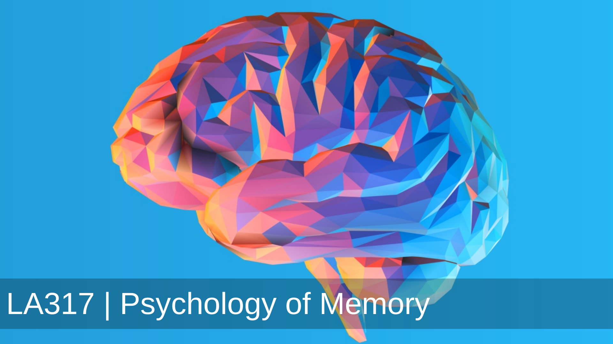

The objective of the experiment is to understand the effect of words that produce concrete imagery vs words that are abstract in nature on the recall ability of visually impaired individuals.

- People under study: visually impaired
- Approximate age: 15-20
- Sample size: minimum 10 people

Methodology:
- Explain the student the whole process about what is this experiment and what is going to happen in the next few hours, don’t tell why the experiment is being done to ensure that the experiment is not contaminated.
- The students will first be addressed to stay calm. And explained the rules of the study.
### The experiment will be as follows:
- The students will be sitting in a different room and one by one students will come to the 2nd room where the experiment is being performed.
- A student will first come to the individual conducting the experiment (let’s call him or her as conductor - experimenter/tester).
- The conductor will take information from the student which will contain the following fields:
    - Name
    - Age
    - Gender
    - Are you blind by birth?
    - Partially or completely blind.
- After the initial amount of information is collected, the students will be made to hear a few words pairs example (recording) (First test recording to test if everything is fine):
>> Bottle - Truth
- The language to be used will be decided based on the visit (both Hindi and English list will be created before hand only one of them will be used) .
- The person will be allowed to sit for 5 minutes.(What should be the duration?)(Finalize the recording)
- After 5 minutes, the student will be called and given the same set of words but in this case only the first word will be given and the second word will be suggested by the student based on his or her memory.
- Hindi words will be written using english for our own ease. 
What was the response
The results will be recorded, some subjective information will be collected from the student regarding some words and what comes to their mind when that word is spoken.  (Maybe at the end of the experiment)
The process will be repeated again for the next student from a-g.
The words will be decided and added as an appendix to this document.

---

